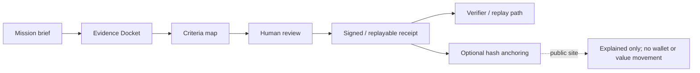
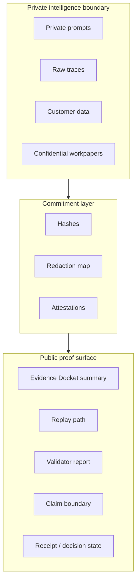
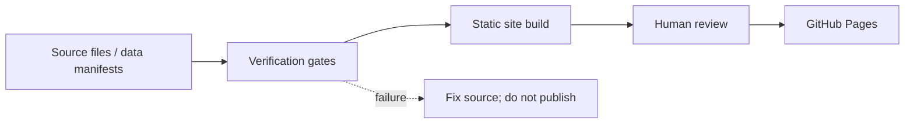
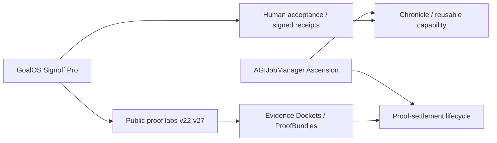

# GoalOS Signoff Pro

**GoalOS Signoff Pro is the human acceptance and signed-receipt layer for AI work: it helps teams define done, map evidence, review claims, and publish replayable proof artifacts without turning the public demo into a wallet, payment, upload, analytics, or advice surface.**

Production website: <https://montrealai.github.io/goalos-signoff-pro/>

[](https://github.com/MontrealAI/goalos-signoff-pro/actions/workflows/ci.yml)
[](https://github.com/MontrealAI/goalos-signoff-pro/actions/workflows/pages.yml)
[](https://github.com/MontrealAI/goalos-signoff-pro/actions/workflows/website-quality.yml)
[](https://github.com/MontrealAI/goalos-signoff-pro/actions/workflows/goalos-signoff-public-labs-v22-v27.yml)
[](https://github.com/MontrealAI/goalos-signoff-pro/actions/workflows/institutional-excellence.yml)
[](LICENSE)


## 30-second explanation

AI can produce persuasive output before anyone can prove that the work is complete. GoalOS Signoff Pro turns acceptance into a governed proof loop: commission work, submit evidence, map criteria, review, accept, and issue a signed/replayable receipt. The public site demonstrates that loop with browser-local proof labs and sample artifacts only. It does not request uploads, collect personal data, connect wallets, move funds, provide legal or financial advice, or claim completed AGI/ASI.

> AI creates output. GoalOS creates proof. No Evidence Docket, no strong public claim.

## Best first clicks

| If you are... | Start here | Why |
| --- | --- | --- |
| New visitor | [Production website](https://montrealai.github.io/goalos-signoff-pro/) | Understand the product promise and public-safe boundary. |
| Executive | [docs/START_HERE.md](docs/START_HERE.md) | Two-minute narrative, user intents, and acceptance gates. |
| Reviewer | [docs/DEMO_CATALOG.md](docs/DEMO_CATALOG.md) | Inspect Mission 001, verifier routes, settlement-readiness demos, and labs v22-v27. |
| Developer | [docs/CODEX_RUNBOOK.md](docs/CODEX_RUNBOOK.md) | Build, verify, and update generated public site artifacts safely. |
| Operator | [docs/PUBLIC_SITE_OPERATIONS.md](docs/PUBLIC_SITE_OPERATIONS.md) | Know what is simulated, public-safe, private-beta, optional, or out of scope. |
| Legal/risk reviewer | [docs/CLAIM_BOUNDARY.md](docs/CLAIM_BOUNDARY.md) | Public-safe invariants, AGIALPHA/token boundaries, and non-advice posture. |

## Core doctrine

- A model can answer. An agent can act. An institution must prove.
- No Evidence Docket, no strong public claim.
- No ProofBundle, no settlement signal.
- No replay, no settlement.
- Public demos are browser-local, public-safe, and claim-bounded.

## Six Signoff gates

1. **Commission work** — define objective, roles, acceptance criteria, and evidence requirements.
2. **Submit evidence** — attach or reference artifacts in an Evidence Docket in the private/product context.
3. **Map criteria** — connect each acceptance criterion to evidence and unresolved gaps.
4. **Review** — human reviewers inspect claims, evidence, conflicts, and replay readiness.
5. **Accept** — authorized humans approve, reject, or request changes.
6. **Issue signed/replayable receipt** — publish a receipt with hashes, verifier output, and claim boundaries.

## What this repository contains

- A Next.js private-beta/SaaS acceptance workspace scaffold and verification scripts.
- Static GitHub Pages public demo artifacts in `site/`.
- Mission 001 reproducibility material and public proof demonstrations.
- Public labs v22-v27 covering action authority, proof-carrying artifacts, independent replay, ProofZero planning, mission foundry, and process-resolved evidence.
- Blockchain anchoring contracts and relayer examples for optional verified receipts, kept separate from the public no-wallet demo posture.
- Documentation, workflow, and repository-readiness checks for safe review.

## What this repository does not do

- It does not add a public wallet connection, token approval, network switch, transaction broadcast, payment flow, escrow, custody, or value movement.
- It does not request public uploads, public forms, personal data, customer data, confidential workpapers, cookies, analytics, or tracking pixels.
- It does not provide investment, tax, legal, medical, safety-certification, or financial advice.
- It does not claim completed AGI or ASI, empirical SOTA, external audit completion, production certification, guaranteed ROI, autonomous sovereignty, or safe autonomy proven.
- It does not treat AGIALPHA references as anything beyond an identity/protocol-boundary reference unless a future expert-only document explicitly says otherwise.

## Canonical demos and route catalog

See [docs/DEMO_CATALOG.md](docs/DEMO_CATALOG.md) for the full route and artifact map.

| Demo | Route / artifact | Output artifact | Boundary |
| --- | --- | --- | --- |
| Public front door | `site/index.html` | Start-by-intent institutional hub | Browser-local public explanation; no intake. |
| Mission 001 | `mission-001.html` when generated | Reproducibility packet and Evidence Docket narrative | Sample/demo proof only. |
| Receipt verifier | `verify.html` when generated | Receipt verification explanation | No legal advice; no jurisdictional acceptance guarantee. |
| Settlement-readiness lab | proof-settlement generated routes/artifacts | Simulated settlement signal | No escrow release and no value moved. |
| Public labs v22-v27 | `public-demo-labs.html`, `goalos-public-demo-labs.html` | Six lab pages plus JSON manifest | No forms, inputs, uploads, wallets, analytics, or payments. |

## Architecture map



## GoalOS proof lifecycle

```mermaid
flowchart LR
  O[Objective] --> M[Mission Contract]
  M --> W[Work / Agent Execution]
  W --> E[Evidence Docket]
  E --> P[ProofBundle]
  P --> R[Replay]
  R --> V[Validation]
  V --> H[Human Authority]
  H --> D[Governed Decision State]
  D --> C[Chronicle]
  C --> K[Reusable Capability]
```



## Public/private proof boundary



## Local verification commands

```bash
node --version
npm --version
npm ci
npm run typecheck
npm run lint
npm run test
npm run build
npm run repo:verify
npm run repo:all
npm run package:verify
npm run pro:verify
npm run hybrid:anchor:check
npm run institutional:verify
node scripts/verify-goalos-production-site.mjs
node scripts/verify-goalos-signoff-public-labs-v22-v27.mjs
git diff --check
```

## GitHub Pages / deployment

The public website is generated into `site/` and published by the Pages workflows. Update source scripts first, regenerate derived artifacts, and then run repository verification. Do not hand-edit generated HTML if a builder script owns the route.



## Cross-repo product map



## Claim boundary

Signoff Pro makes a bounded product claim: proof-governed acceptance is a practical way to review AI work. Stronger claims require an Evidence Docket, ProofBundle, replay path, validator report, human authority, and claim-boundary language. See [docs/CLAIM_BOUNDARY.md](docs/CLAIM_BOUNDARY.md).

### What would prove more

- Independent replay by reviewers who did not author the original work.
- Multiple accepted missions with published receipts, challenge windows, and contradiction reports.
- Clear separation between private evidence, public commitments, and public-safe summaries.
- External review of specific claims, described as review of those claims rather than a broad certification.

### What would falsify the claim

- Missing, contradictory, or unreplayable evidence for a strong public claim.
- A receipt whose hashes or artifacts do not verify.
- A public page that requests uploads, connects wallets, tracks users, moves funds, or implies legal/financial acceptance beyond the documented boundary.
- Unbounded claims of completed AGI/ASI, live settlement, guaranteed ROI, or production certification.

## Contributing, security, and support

- Contributing: [CONTRIBUTING.md](CONTRIBUTING.md)
- Security: [SECURITY.md](SECURITY.md)
- Support: [SUPPORT.md](SUPPORT.md)
- Governance: [GOVERNANCE.md](GOVERNANCE.md)
- Contact: `info@quebec.ai`
