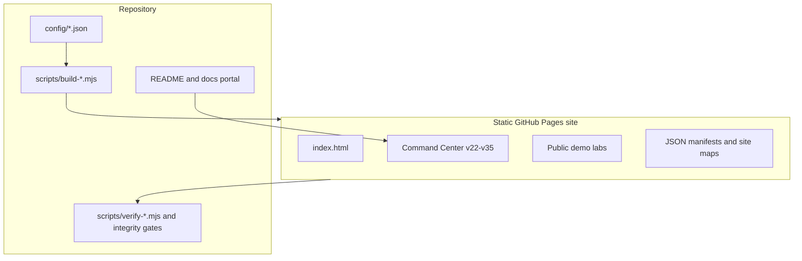
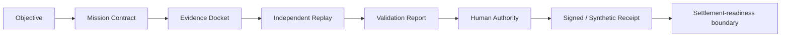
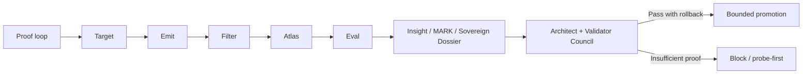

# GoalOS Signoff Pro

[](https://github.com/MontrealAI/goalos-signoff-pro/actions/workflows/pages.yml) [](https://github.com/MontrealAI/goalos-signoff-pro/actions/workflows/website-quality.yml) [](https://github.com/MontrealAI/goalos-signoff-pro/actions/workflows/goalos-signoff-v22-v35-complete-repair-and-publish.yml) [](https://github.com/MontrealAI/goalos-signoff-pro/actions/workflows/goalos-signoff-v22-v35-ultimate-experience-integrity.yml)    [](https://github.com/MontrealAI/goalos-signoff-pro/actions/workflows/goalos-signoff-v22-v35-diamond-command-console-experience.yml)

**GoalOS Signoff Pro is the institutional proof-to-acceptance layer for AI work: evidence first, replay before trust, human authority before settlement readiness.**

> Blockchain proves the transaction. GoalOS proves the work. RSI governs invention. ASI must not self-authorize.
>
> **No Proof. No Trust. No Settlement.**

## Start here

Open the premium command center first: [site/goalos-v22-v35-command-center.html](site/goalos-v22-v35-command-center.html). Public aliases include [Start Here](site/start-here.html), [Latest](site/latest.html), [Command Center](site/command-center.html), [Experience](site/experience.html), [Demo](site/demo.html), [Proof to Superintelligence](site/proof-to-superintelligence.html), [Governed Superintelligence](site/governed-superintelligence.html), and [v22-v35](site/v22-v35.html).


## 30-second explanation

GoalOS Signoff Pro turns AI work from a persuasive claim into an inspectable acceptance record. A mission defines what counts, evidence is attached, replay and validation test the claim, human authority signs or withholds acceptance, and a receipt records the decision boundary.

## Best first clicks

1. [Command Center](site/goalos-v22-v35-command-center.html) — the guided v22-v35 start path.
2. [Public Demo Hub](site/public-demo-labs.html) — all labs grouped by chapter.
3. [v35 Mission Simulator](site/loop-rsi-asi-superintelligence-mission-simulator-lab.html) — the latest public-safe simulator.
4. [Docs Portal](docs/INDEX.md) — audience-specific documentation.

## Six Signoff gates

1. Mission boundary.
2. Evidence docket.
3. Replay path.
4. Validation report.
5. Human authority.
6. Signed or synthetic receipt with settlement-readiness boundary.

## What GoalOS Signoff Pro is

GoalOS Signoff Pro demonstrates how a work claim becomes an acceptance-grade record: mission contract, evidence docket, replay, validator review, human signoff, signed receipt, and settlement-readiness boundary. The public site is static, browser-local, and sample-data oriented. It does not collect personal data or move value.

## Diamond v22-v35 website experience

The recommended public entry point is [site/goalos-v22-v35-command-center.html](site/goalos-v22-v35-command-center.html). It gives first-time visitors, blockchain stakeholders, executives, auditors, and RSI/ASI governance readers one guided path through all 14 public labs.

Run the manual workflow **GoalOS Signoff Pro — Diamond v22-v35 Command Console Experience** to rebuild, polish, verify, commit, and optionally deploy the complete website.

## Public website

- Website: https://montrealai.github.io/goalos-signoff-pro/
- Demo hub: [site/public-demo-labs.html](site/public-demo-labs.html)
- Latest simulator: [site/loop-rsi-asi-superintelligence-mission-simulator-lab.html](site/loop-rsi-asi-superintelligence-mission-simulator-lab.html)
- Documentation portal: [docs/INDEX.md](docs/INDEX.md)

## v22-v35 demonstration suite

| Version | Lab | Core idea |
| --- | --- | --- |
| v22 | [Action Graph & Human Authority](site/action-graph-authority-lab.html) | Action is not authority; proof earns scope. |
| v23 | [Proof-Carrying Artifact & Evolution Ledger](site/proof-carrying-artifact-lab.html) | Reusable capability must carry proof. |
| v24 | [Independent Replay & Claim Promotion](site/independent-replay-lab.html) | One run is not proof; replay makes it public. |
| v25 | [ProofZero Planning & Evidence Reanalyze](site/proofzero-planning-lab.html) | Plan over proof states, not persuasive futures. |
| v26 | [Proof-Gated Mission Foundry & Curriculum](site/mission-foundry-lab.html) | Accepted proof becomes the next harder mission. |
| v27 | [Process-Resolved Evidence](site/process-evidence-lab.html) | Final output is not proof; process lineage matters. |
| v28 | [Blockchain Credibility Standard](site/blockchain-credibility-lab.html) | Blockchain proves the transaction; GoalOS proves the work. |
| v29 | [Blockchain Proof Mandate & Due Diligence](site/blockchain-proof-mandate-lab.html) | Require the proof package before trust, funding, governance, reputation, or settlement readiness. |
| v30 | [Proof Before Settlement Research Standard](site/proof-before-settlement-research-lab.html) | Proof before settlement becomes an institutional standard. |
| v31 | [Executive AI Proof Console](site/executive-ai-proof-console.html) | Make proof obvious through a role-based console. |
| v32 | [From Loop to RSI](site/from-loop-to-rsi-lab.html) | The proof loop becomes deterministic invention governance. |
| v33 | [Loop → RSI → ASI Console](site/loop-rsi-asi-superintelligence-lab.html) | Recursive self-improvement requires gates, dossiers, councils, and rollback. |
| v34 | [ASI Superintelligence Control Tower](site/loop-rsi-asi-superintelligence-control-tower-lab.html) | ASI-readiness needs a control tower, not a slogan. |
| v35 | [ASI Mission Simulator](site/loop-rsi-asi-superintelligence-mission-simulator-lab.html) | Run a public-safe simulator with gates, metrics, dossiers, and synthetic receipts. |

## Architecture



## Proof-to-acceptance flow



## Loop → RSI → ASI governance flow



Search may guide allocation. Proof decides promotion. Breakthroughs are audited state transitions, not narratives.

## GitHub Web UI instructions

1. Download the repository or update package as a ZIP.
2. Unzip it locally.
3. Upload the contents of the unzipped folder, not the outer folder.
4. Include hidden files and the hidden `.github` folder.
5. Commit to a new branch.
6. Run **GoalOS Signoff Pro — Complete v22-v35 Repair and Publish**.
7. Verify the Pages deployment and open `/goalos-signoff-pro/goalos-v22-v35-command-center.html`.

## Local developer workflow

```bash
npm ci
npm run lint
npm run typecheck
npm run test
npm run build
npm run site:verify:all
```

Useful focused commands:

```bash
npm run site:build:public-labs
npm run site:verify:workflows
npm run site:verify:routes
npm run site:verify:public-labs
npm run package:verify
npm run repo:verify
npm run institutional:verify
```

## Workflow guide

- `.github/workflows/goalos-signoff-v22-v35-complete-repair-and-publish.yml` is the canonical one-go manual repair, verification, preview artifact, and optional Pages deploy workflow.
- `scripts/verify-workflow-script-references.mjs` fails when a workflow references a missing `node scripts/*.mjs` file.
- `scripts/check-site-route-integrity.mjs` verifies flagship routes, aliases, manifests, public-safe boundaries, and forbidden public claims.


## What this repository does not do

This repository does not run public custody, escrow release, staking, token sale, brokerage, live Mainnet settlement, wallet connection, public uploads, public forms, analytics, external AI calls, or personal-data collection. It does not provide legal, financial, tax, or investment advice.

## What would prove more

More evidence would include independent replay reports, external institutional audits, production security reviews, live customer acceptance records with appropriate privacy controls, and formally governed pilot outcomes.

## What would falsify

Broken routes, missing scripts referenced by workflows, unverifiable generated artifacts, public pages that collect data or move value, unsupported AGI/ASI/production-RSI claims, or receipts that cannot be replayed would falsify the public posture.

## Claim boundary and public-safe posture

The public demos are deterministic simulations and institutional review aids. They are not live Mainnet settlement, custody, escrow, staking, token sale, brokerage, legal advice, financial advice, tax advice, investment advice, realized AGI, realized ASI, production RSI, autonomous deployment authority, external audit completion, or guaranteed ROI. There are no public forms, text inputs, uploads, cookies, analytics, wallets, payments, external AI calls, personal data, or value movement.

## Maintainership and contribution links

- [CONTRIBUTING.md](CONTRIBUTING.md)
- [SECURITY.md](SECURITY.md)
- [GOVERNANCE.md](GOVERNANCE.md)
- [SUPPORT.md](SUPPORT.md)
- [LEGAL.md](LEGAL.md)
