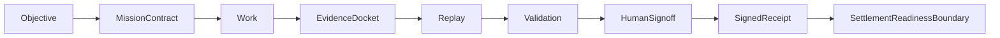
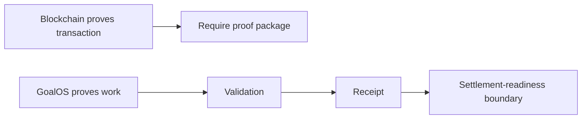
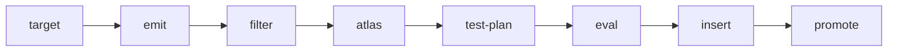
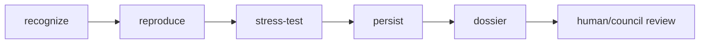
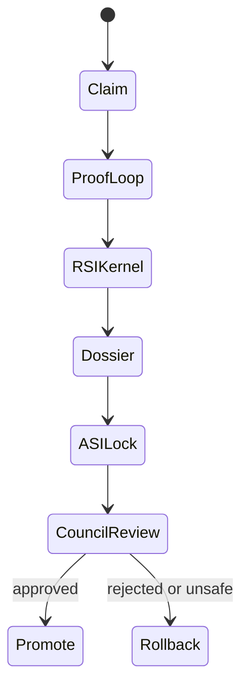
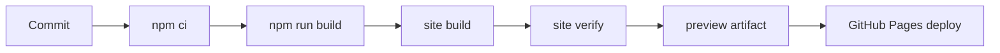

# Flowcharts

Purpose: collect Mermaid diagrams for the proof-to-acceptance, RSI, ASI, and release pipeline.

Best first action: open [`site/goalos-v22-v35-command-center.html`](../site/goalos-v22-v35-command-center.html), then continue to the recommended lab.

Relevant routes: [`site/index.html`](../site/index.html), [`site/public-demo-labs.html`](../site/public-demo-labs.html), [`site/goalos-v22-v35-command-center.html`](../site/goalos-v22-v35-command-center.html), [`site/loop-rsi-asi-superintelligence-mission-simulator-lab.html`](../site/loop-rsi-asi-superintelligence-mission-simulator-lab.html).

Verification command: `npm run site:all`.

Public-safe boundary: no forms, no inputs, no uploads, no cookies, no analytics, no wallets, no payments, no external AI calls, no personal data, zero value moved. This is not legal advice, financial advice, investment advice, live settlement, achieved AGI/ASI, or production RSI.

Back to [docs index](INDEX.md).
