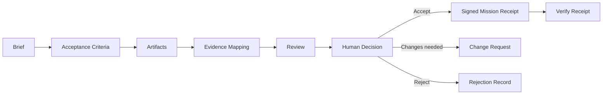

# Mission Receipt lifecycle

A Mission Receipt is the signed acceptance record for AI-delivered work. It should be treated as a bounded proof object: it records what was accepted, which evidence supported the decision, who had authority, and how a reviewer can verify the receipt.

## Lifecycle

## Receipt contents

A mature Mission Receipt should include:

- mission identifier and objective;
- acceptance criteria snapshot;
- Evidence Docket or public-safe evidence summary;
- hashes or references for accepted artifacts;
- reviewer and human-authority fields appropriate to the private context;
- decision state: accepted, rejected, or changes requested;
- replay or verification instructions;
- claim-boundary language stating what the receipt does and does not prove.

## Public demo boundary

Public demo receipts are sample-data objects. They demonstrate receipt grammar and verification logic only. They do not create legal acceptance, customer acceptance, payment authorization, wallet activity, escrow release, production certification, or external audit completion.

## Optional anchoring boundary

Optional hash anchoring may be documented as a future or expert-only verification path. Public demos must not connect wallets, request token approvals, switch networks, broadcast transactions, move funds, or imply live settlement.

## Failure modes

A receipt is weak or invalid when evidence is missing, hashes do not match, replay fails, authority is unclear, claims exceed the docket, or the receipt implies advice, certification, live settlement, or value movement that is not actually present.
