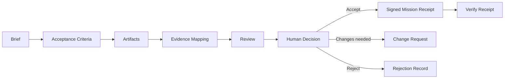
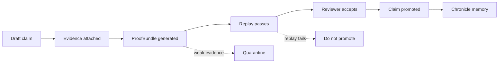
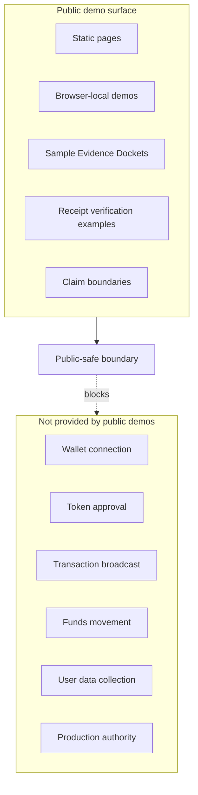

# GoalOS proof lifecycle

GoalOS Signoff Pro turns AI-delivered output into reviewable institutional work. The public repository demonstrates the grammar of proof; it does not collect production evidence through public pages and does not grant production authority.

## Universal lifecycle

```mermaid
flowchart LR
  O[Objective] --> M[Mission Contract]
  M --> W[Work / Agent Execution]
  W --> E[Evidence Docket]
  E --> P[ProofBundle]
  P --> R[Replay]
  R --> V[Validation]
  V --> H[Human Authority]
  H --> D[Governed Decision State]
  D --> C[Chronicle]
  C --> K[Reusable Capability]
```

## Signoff Pro acceptance flow

## Claim maturity ladder

## Public-safe boundary

## Lifecycle gates

| Gate | Evidence question | Failure mode |
| --- | --- | --- |
| Objective | Is the work request explicit enough to review? | Ambiguous scope or unverifiable success criteria. |
| Mission Contract | Are roles, criteria, and constraints recorded? | Missing authority, risk, or acceptance boundary. |
| Evidence Docket | Does each claim have inspectable evidence? | No Evidence Docket, no strong public claim. |
| ProofBundle | Can evidence, hashes, receipts, and reports travel together? | No ProofBundle, no settlement signal. |
| Replay | Can a reviewer reproduce the relevant result or reasoning path? | No replay, no settlement. |
| Validation | Are contradictions, gaps, costs, and risks recorded? | Rubber-stamp review or hidden failure. |
| Human Authority | Did an authorized human decide? | No authority, no autonomy. |
| Chronicle | Is accepted learning preserved for future work? | Capability cannot safely compound. |

## What this lifecycle claims

It claims that GoalOS Signoff Pro can demonstrate a disciplined public grammar for acceptance: evidence, criteria mapping, replay, validation, human authority, and signed receipts.

## What it does not claim

It does not claim achieved AGI, achieved ASI, empirical SOTA, live settlement, legal or financial advice, external certification, production safety, or autonomous authority from public pages.
