# Public site operations

**GoalOS Signoff Pro is the human acceptance and signed-receipt layer for AI work.** Public pages are browser-local, claim-bounded, and do not add wallets, payments, uploads, analytics, cookies, or user-data intake.

## 30-second explanation

A visitor should understand the project as a proof-to-acceptance system: AI work is commissioned, evidence is mapped to criteria, humans review the record, and accepted work receives a signed/replayable receipt. The public site demonstrates this posture with sample artifacts only.

## Best first clicks

| Intent | Link |
| --- | --- |
| Start | [START_HERE.md](START_HERE.md) |
| Demo routes | [DEMO_CATALOG.md](DEMO_CATALOG.md) |
| Architecture | [ARCHITECTURE.md](ARCHITECTURE.md) |
| Verification | [VERIFICATION.md](VERIFICATION.md) |
| Public operations | [PUBLIC_SITE_OPERATIONS.md](PUBLIC_SITE_OPERATIONS.md) |
| Claim boundary | [CLAIM_BOUNDARY.md](CLAIM_BOUNDARY.md) |
| FAQ | [FAQ.md](FAQ.md) |

## Proof lifecycle

```mermaid
flowchart LR
  O[Objective] --> M[Mission Contract]
  M --> W[Work / Agent Execution]
  W --> E[Evidence Docket]
  E --> P[ProofBundle]
  P --> R[Replay]
  R --> V[Validation]
  V --> H[Human Authority]
  H --> D[Governed Decision State]
  D --> C[Chronicle]
  C --> K[Reusable Capability]
```

## Public-safe boundary summary

No public wallet connection, token approval, network switching, transaction broadcast, custody, escrow release, value movement, payment, token sale, analytics, cookies, tracking pixels, secrets, user uploads, public form intake, personal data, customer data, confidential data, or unbounded AGI/ASI/SOTA/ROI/certification claims.

## Release checklist

- [ ] README and docs links resolve.
- [ ] Public route boundary copy is present.
- [ ] Generated site artifacts are regenerated from source.
- [ ] Verification commands and skipped checks are recorded.
