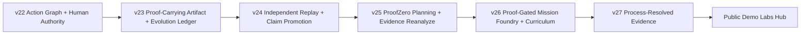

# Public labs v22-v27 curriculum

GoalOS Signoff Pro public labs v22-v27 are a six-stop curriculum for the core public-safe thesis: AI output becomes institutionally usable only when evidence, replay, human authority, process lineage, and signed receipts make the work reviewable.

Public demos are browser-local, public-safe, and claim-bounded. They do not collect data, connect wallets, move funds, create payments, request uploads, or grant production authority.

## Curriculum path

## Labs at a glance

| Lab | Institutional question | Proof object illustrated | What it does not do |
| --- | --- | --- | --- |
| v22 Action Graph & Human Authority | Who is allowed to authorize scoped action? | Authority-gated action receipt | Does not self-authorize high-impact action. |
| v23 Proof-Carrying Artifact & Evolution Ledger | Can a reusable artifact influence future work? | Proof-backed upgrade right and evolution ledger | Does not certify production safety or external audit. |
| v24 Independent Replay & Claim Promotion | Can an independent reviewer reproduce the claim? | Claim promotion certificate and replay operator reports | Does not promote unreplayed claims. |
| v25 ProofZero Planning & Evidence Reanalyze | Can planning stay bounded by evidence? | Evidence reanalysis ledger and planning scoreboard | Does not grant autonomous production authority. |
| v26 Proof-Gated Mission Foundry & Curriculum | Can accepted proof create harder missions? | Mission seed certificate and generated curriculum | Does not claim solved general intelligence. |
| v27 Process-Resolved Evidence | Can reviewers inspect the process, not only the answer? | Process validator report, claim lineage, tool-scope ledger | Does not collect private traces or confidential data. |

## Recommended review sequence

1. Start at the [public demo labs hub](../site/public-demo-labs.html) or production route `public-demo-labs.html`.
2. Read each card for audience, proof object, and boundary.
3. Open the canonical lab route.
4. Inspect the JSON artifacts listed by the card and global manifest.
5. Confirm the public-safe posture: no forms, no inputs, no uploads, no wallets, no payments, no analytics, no cookies, no personal data, and no value moved.
6. Record any claim that lacks evidence as a weak claim until a docket, replay, and human decision support it.

## Why these six labs matter

Together, v22-v27 show governed action, proof-carrying artifacts, independent replay, evidence reanalysis, mission curriculum, and process-resolved evidence — the public-safe path from output to institutional proof.

## Related files

- [Demo catalog](DEMO_CATALOG.md)
- [GoalOS Signoff public labs v22-v27 install guide](GOALOS_SIGNOFF_PUBLIC_LABS_V22_V27_GLOBAL_INSTALL.md)
- [Claim boundary](CLAIM_BOUNDARY.md)
- [Public site operations](PUBLIC_SITE_OPERATIONS.md)
